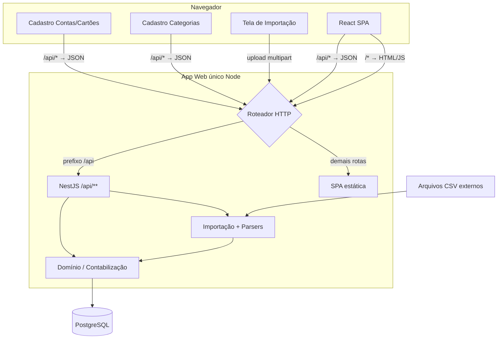
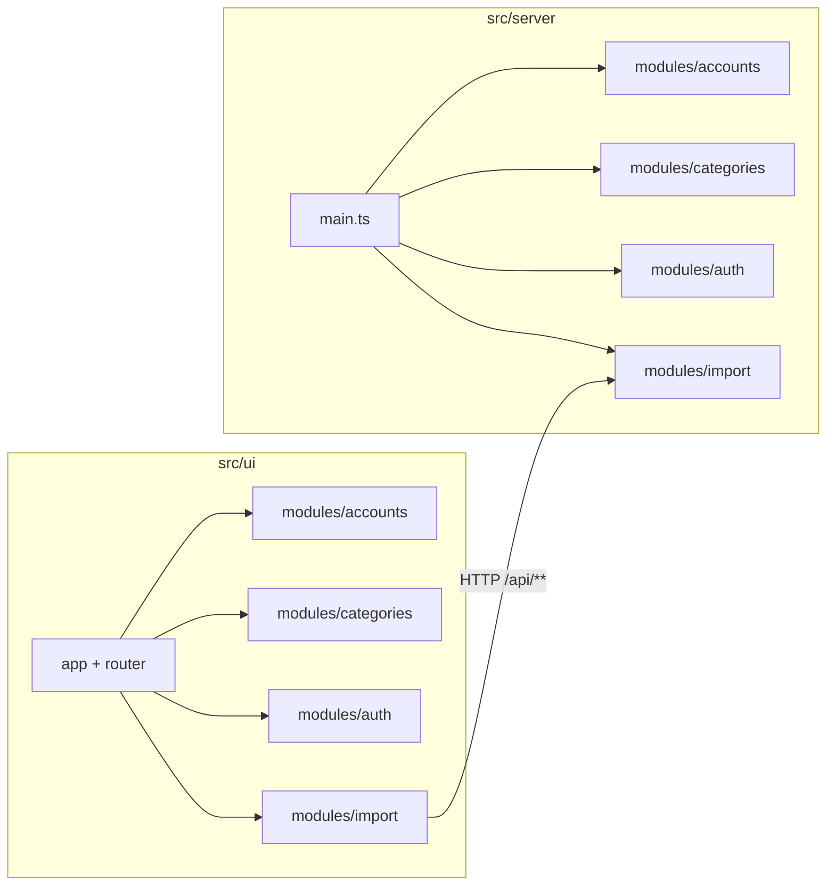
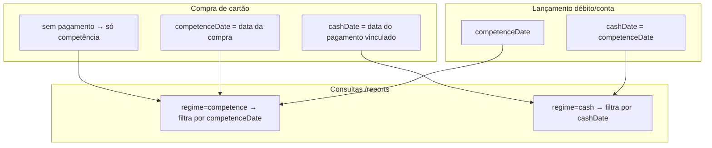
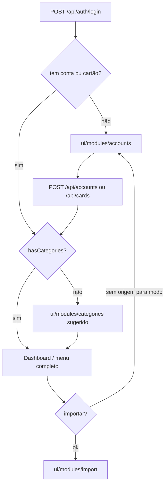
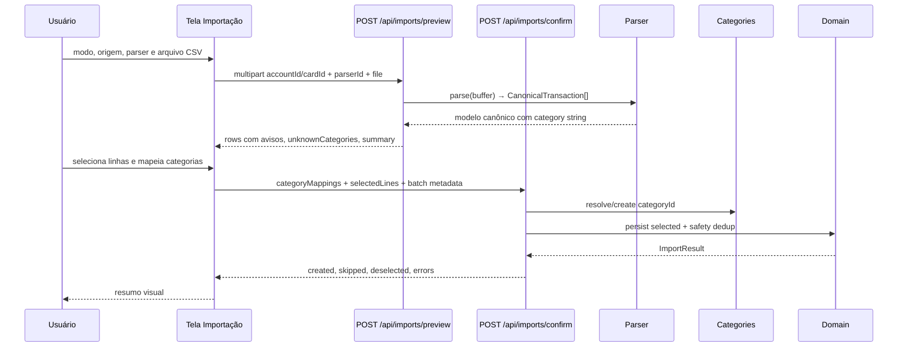

# Mão de Vaca — Arquitetura do MVP

**Status:** Rascunho para planejamento de implementação  
**Última atualização:** 2026-09-03  
**Fonte de verdade do produto:** [PROJECT_DEFINITION.MD](./PROJECT_DEFINITION.MD)

Este documento descreve *como* o MVP é construído em alto nível. Histórias de usuário, épicos e tarefas devem rastrear até aqui e até a definição de produto (especialmente §3, §5 e §6).

---

## 1. Propósito

Mão de Vaca é uma aplicação web pessoal de controle de gastos e receitas. O usuário **primeiro cadastra contas, cartões e categorias**; em seguida importa extratos e faturas em CSV (pré-categorizados externamente), vinculados a essas origens. O diferencial central é permitir enxergar os gastos sob **dois regimes simultâneos** — competência e caixa — com fatura de cartão modelada como **passivo**, pagamentos de fatura como tipo **`INVOICE_PAYMENT`** (sem contagem duplicada) e entrada de dados exclusivamente pela **interface web**.

---

## 2. Princípios de arquitetura

| Princípio | Escolha |
|-----------|---------|
| **Dono do domínio** | Módulos em `src/server/` (NestJS) são a única fonte de verdade para regras de negócio, regimes, saldos de fatura e deduplicação |
| **Papel da UI** | React em `src/ui/` renderiza snapshots da API e envia comandos — sem lógica de contabilização duplicada. Direção visual: [docs/design/UI_REFERENCE.md](./design/UI_REFERENCE.md) |
| **Formato do app** | Um único app web: NestJS hospeda a API (`/api/**`) e serve o build estático da SPA para o restante |
| **Sem código compartilhado** | `server/` e `ui/` **não importam** tipos, DTOs ou utilitários um do outro; contratos vivem apenas na API HTTP |
| **Cadastro primeiro** | Contas, cartões e categorias são **requisitos do domínio antes da importação**; lançamentos e faturas dependem de origens e categorias cadastradas |
| **Setup obrigatório** | Após login, usuário sem contas/cartões é orientado ao cadastro antes de qualquer outra operação de dados; categorias são recomendadas no onboarding mas não bloqueiam importação |
| **Modularidade futura** | `src/server/` e `src/ui/` são extraíveis como apps independentes; módulos espelhados por domínio (`auth`, `accounts`, `import`, …) dentro de cada camada |
| **Multitenant** | Coluna `userId` em todas as entidades desde o MVP; um único usuário fixo provisionado via env/seed |
| **Importação** | **Única via interface web**, após cadastro de origens; modos transações (Conta) e fatura (Cartão + Fatura); parser selecionável (padrão no MVP) |
| **Segredos** | Credenciais de DB e auth apenas no server — nunca no bundle React |
| **Deploy local** | Docker Compose: PostgreSQL + app Node |

---

## 3. Contexto do sistema



**Regra de roteamento:** qualquer requisição com prefixo `/api/**` é tratada pelos controllers NestJS; todas as demais retornam a SPA (fallback `index.html` para client-side routing).

**Internet:** não obrigatória em runtime, exceto para dependências de build. O app opera localmente ou em servidor próprio com PostgreSQL.

---

## 4. Layout do repositório e fronteiras modulares

**Regra:** duas camadas de topo — `src/server/` e `src/ui/` — com módulos de domínio espelhados em cada uma. Comunicação entre camadas **somente via HTTP** (`/api/**`). Nenhuma pasta `shared/`.

```
mao-de-vaca/
  src/
    server/                       # Camada backend — extraível como app NestJS no futuro
      main.ts                     # Bootstrap NestJS + /api/** + serve SPA em prod
      modules/
        auth/                     # Controller, service, guard, DTOs
        accounts/                 # CRUD Conta + Cartão (primeiro módulo de domínio)
        categories/               # CRUD Categoria (antes da importação)
        import/                   # Upload multipart, parsers, modelo canônico, mapeamento de categorias
        transactions/
        invoices/
        parent-purchases/
        reports/
    ui/                           # Camada frontend — extraível como app React no futuro
      main.tsx                    # Entry point React
      app.tsx                     # Shell: layout, providers
      router.tsx                  # Rotas da SPA
      modules/
        auth/
        accounts/                 # Cadastro contas/cartões, onboarding
        categories/               # Cadastro categorias, sugestão no onboarding
        import/
        transactions/
        invoices/
        parent-purchases/
        reports/
  prisma/                         # Schema + migrations (server-only)
  docker-compose.yml
  docs/
    PROJECT_DEFINITION.MD
    ARCHITECTURE.md
```

### Espelhamento de módulos

Cada domínio (`auth`, `accounts`, `categories`, `import`, `transactions`, `invoices`, `parent-purchases`, `reports`) existe em **ambas** as camadas com o mesmo nome. O nome alinha responsabilidades entre server e UI; não há imports cruzados.

| Módulo | `server/modules/` | `ui/modules/` |
|--------|-------------------|---------------|
| **auth** | Login, guard JWT, contexto de tenant | Página de login, proteção de rotas |
| **accounts** | CRUD Conta + Cartão + Banco, `setup/status` | Cadastro, listagem, onboarding pós-login; seleção/criação de banco |
| **categories** | CRUD árvore (depth ≤5), `kind`/`color`/`icon`, unicidade entre irmãos e folhas; `hasCategories` via folhas ativas | `/categorias` com swatch/ícone; CTA soft na home |
| **import** | Preview/confirm, parsers, deduplicação, mapeamento de categorias, `ImportBatch` | Formulário por modo, pré-visualização com mapeamento, histórico, resumo |
| **transactions** | CRUD, tipos, regimes, filtros | Tabela filtrável de lançamentos |
| **invoices** | Faturas, saldo/status derivados, vínculo pagamento | Lista/detalhe de faturas, UI de vínculo manual |
| **parent-purchases** | Agregado informacional, vínculo parcela↔pai | UI de agrupamento de parcelas |
| **reports** | Cálculos por regime, categorias, evolução mensal | Dashboard, gráficos, toggle de regime |

### Regras de fronteira

| Permitido | Proibido |
|-----------|----------|
| `server/modules/X/` importa de `server/modules/Y/` via interfaces de serviço | Qualquer import de `ui/` a partir de `server/` |
| `ui/modules/X/` importa de `ui/` (shell, componentes comuns) ou de `ui/modules/Y/` | Qualquer import de `server/` a partir de `ui/` |
| UI consome API via `fetch('/api/...')` com tipos definidos localmente em `ui/modules/*/` | Pasta `shared/`, pacotes internos ou tipos importados cross-layer |
| Extração futura: `src/server/` → app NestJS; `src/ui/` → app React/Vite | Lógica de domínio (regimes, saldos, dedup) na camada UI |



### Dev vs prod

| Ambiente | Comportamento |
|----------|---------------|
| **Dev** | Vite dev server (`ui/`) com proxy `/api` → NestJS (`server/`), ou NestJS com plugin Vite integrado |
| **Prod** | Build de `ui/` em `dist/ui/`; `server/main.ts` serve estáticos e responde `/api/**` |

**Stack:** TypeScript em todo o app (um `package.json`). NestJS, React + Vite, PostgreSQL (Prisma).

**Fora do escopo do MVP:** apps separados em deploy, fila de importação assíncrona, detecção automática de conta/cartão ou parser na importação.

---

## 5. Dados e domínio

### Modelo de entidades

| Entidade | Armazenamento | Notas |
|----------|---------------|-------|
| **User** | PostgreSQL | Tenant/dono dos dados; único usuário seedado no MVP (`AUTH_*` env vars) |
| **Bank** (`Banco`) | PostgreSQL | `id`, `userId`, `name` (único por usuário); seed MVP: Nubank, Itaú, Inter, Sofisa, Daycoval |
| **Account** (`Conta`) | PostgreSQL | `id`, `userId`, `bankId`, `label`, `active` |
| **Card** (`Cartão`) | PostgreSQL | `id`, `userId`, `bankId`, `label`, `active` |
| **Category** (`Categoria`) | PostgreSQL | Árvore: `id`, `userId`, `parentId?`, `name`, `kind` (`EXPENSE` \| `INCOME` \| `NON_EXPENSE`), `color` (`#RRGGBB`), `icon` (catálogo), `active`; profundidade máx. 5; lançamentos futuros referenciam apenas **folhas** |
| **Transaction** | PostgreSQL | Lançamento: `competenceDate`, `cashDate?` (null em compras de cartão até V6), `type`, `amount`, `categoryId`, `accountId` **ou** `cardId`+`invoiceId`, `importBatchId`, `dedupKey`, `active` (soft-disable; listagem padrão só ativos). |
| **Invoice** | PostgreSQL | Fatura: FK `cardId`, `referenceMonth`, `dueDate`; saldo e status **derivados** (`balance = sum(amount)`) |
| **InvoicePaymentLink** | PostgreSQL | Vínculo M:N pagamento↔fatura; suporta pagamento parcial e cross-bank |
| **ParentPurchase** | PostgreSQL | Agregado informacional; não entra em somas; parcelas vinculadas manualmente |
| **ImportBatch** | PostgreSQL | `importMode` (`transactions` \| `invoice`), `accountId` ou `cardId`, `invoiceId?`, `parserId`, resultado; cada lançamento criado no lote aponta para este `id` |

### Regras derivadas (do domínio)

| Regra | Descrição |
|-------|-----------|
| **Saldo de fatura** | `balance = sum(amount)` das txs ativas da fatura − `sum(amount)` dos pagamentos vinculados. Status: `open` / `partial` / `paid` (V6) |
| **Status de fatura** | Derivado do saldo: em aberto (`balance < 0`) / quitada (`balance === 0`); parcial após V6 |
| **Totais de gasto/receita** | `saldo = receitas − despesas`; `TRANSFER` e `INVOICE_PAYMENT` não entram (RN-01, RN-02) |
| **Pagamento de fatura** | Sempre tipo `INVOICE_PAYMENT` após vínculo; nunca despesa nas somas — evita contagem duplicada (RN-02). Não importar do CSV da fatura — vínculo manual na Conta (V6). `TRANSFER` reservado para Conta↔Conta (futuro). |
| **Compra-pai** | Nunca contabilizada; apenas parcelas entram nas somas (RN-03) |
| **Estorno** | Na fatura: `EXPENSE` com valor positivo no CSV; nunca receita (RN-04) |
| **Investimento** | Transferência: afeta caixa, não afeta gasto nem receita (RN-05) |
| **Caixa de cartão** | Reconhecido pela data do pagamento real da fatura, não pelo vencimento (RN-06); até lá `cashDate` null |
| **Completude do caixa** | Gastos de cartão só aparecem em caixa quando pagamentos estão registrados e vinculados (RN-07) |
| **Pré-requisito de importação** | Conta ou cartão cadastrado obrigatório; rejeição sem origem válida (RN-08) |
| **Origens desativadas** | Não aparecem em nova importação; histórico preservado (RN-09) |
| **Fatura e cartão** | Fatura sempre vinculada a cartão cadastrado (RN-10) |
| **Categoria e lançamento** | Todo lançamento referencia `categoryId` de uma **folha** cadastrada (RN-11–13); profundidade máx. 5 |

### Regimes: competência vs caixa



O toggle de regime (RF-08) é global na UI (`ui/`) e propagado como parâmetro `regime=competence|cash` em todas as chamadas de relatório e listagem.

### Modelo canônico de importação (server-only)

Todo parser, independentemente de banco ou formato, produz lançamentos neste modelo interno antes da persistência:

| Campo | Descrição |
|-------|-----------|
| `competenceDate` | Data de competência |
| `cashDate` | Data de caixa: no extrato = competência; na fatura = `null` até vínculo de pagamento (V6) |
| `description` | Descrição do lançamento |
| `amount` | Valor signed do CSV. **Extrato:** negativo = despesa; positivo = receita. **Fatura:** negativo = gasto; positivo = estorno (ambos `EXPENSE`; nunca `INCOME` — RN-04). Usuário remove linhas de pagamento do CSV antes de importar |
| `type` | `EXPENSE` \| `INCOME` \| `TRANSFER` \| `INVOICE_PAYMENT` (enum persistido; extrato deriva EXPENSE/INCOME do sinal; fatura: sinal → só `EXPENSE`; `TRANSFER` via coluna opcional `tipo` / futuro Conta↔Conta; `INVOICE_PAYMENT` ao vincular pagamento à fatura — V6) |
| `category` | Nome da categoria pré-atribuída no CSV (string do parser; resolvida para `categoryId` na confirmação; opcional no modo fatura → `(sem categoria)`) |
| `accountId` | Conta cadastrada (modo transações) — mutuamente exclusivo com `cardId` |
| `cardId` | Cartão cadastrado (modo fatura) |
| `dedupKey` | Identificador estável para deduplicação (`accountId`/`cardId` + data + valor + descrição + índice de ocorrência no arquivo; occurrence 1 compatível com chave legada) |
| `invoiceId` | Fatura de destino (modo fatura) |

Interface TypeScript em `src/server/modules/import/parsers/`; mapeamento para entidades Prisma no módulo de domínio. **Não exposto à UI.**

---

## 6. Fluxos principais

### 6.0 Onboarding — cadastro de contas, cartões e categorias

O cadastro é o **primeiro fluxo de dados** após autenticação — anterior a importação, lançamentos e relatórios (RF-00d a RF-00k).

1. Usuário faz login
2. UI consulta `GET /api/setup/status`
3. Se não há contas nem cartões → redirect para `/contas` (ou wizard de setup) com mensagem explicativa
4. Usuário cadastra ao menos uma **Conta** e/ou **Cartão**
5. Sistema **sugere** cadastro de **Categorias** em `/categorias` quando `hasCategories` é false (não bloqueia importação)
6. Somente com conta ou cartão cadastrado a navegação libera importação e demais módulos de dados



- Rotas `/contas`, `/cartoes` e `/categorias` (ou aba única "Contas e cartões" + menu Categorias)
- Desativação em vez de delete quando há lançamentos vinculados (contas, cartões e categorias)

### 6.1 Interface web de importação

A importação é o canal de entrada de lançamentos — feita em `ui/modules/import/`, **após** cadastro de origens e **com módulo de categorias disponível** (RF-01, RF-02a–e). Bloqueada se não houver conta (modo transações) ou cartão + fatura (modo fatura).

**Componentes da UI:**

| Componente | Função |
|------------|--------|
| **Seleção de modo** | Transações (extrato) ou fatura (cartão) |
| **Seleção de origem** | Conta cadastrada **ou** Cartão + Fatura de destino |
| **Seleção de parser** | Dropdown; único item "Padrão" no MVP |
| **Upload** | Arquivo `.csv` + botão enviar |
| **Pré-visualização** | Lista com checkbox por linha; avisos de duplicata (`existing` / `within_file`); destaque de **categorias desconhecidas** com UI de mapeamento |
| **Seleção de linhas** | Usuário escolhe o que importar; ação “Desmarcar avisos de duplicação”; defaults: `existing` desmarcado, demais válidas marcadas |
| **Confirmação** | Persistência das linhas selecionadas após categorias das selecionadas resolvidas (RN-12) |
| **Estado de progresso** | Loading durante processamento síncrono no server |
| **Resumo pós-importação** | Contadores: novos, duplicados ignorados (rede de segurança), desmarcados, erros por linha |
| **Histórico** | Lista de `ImportBatch` anteriores; exclusão hard delete com confirmação e guards |

**Fluxo do usuário:**

1. Usuário autenticado acessa `/importar` (somente se setup de origens completo)
2. Escolhe modo: **transações** ou **fatura**
3. Seleciona **Conta** (transações) ou **Cartão + Fatura** (fatura)
4. Seleciona parser (padrão no MVP)
5. Faz upload do CSV
6. UI envia `multipart/form-data` para `POST /api/imports/preview`
7. Server parseia e retorna preview com `unknownCategories[]`, `duplicateWarning` por linha e `summary.duplicateWarningCount`
8. Usuário revisa seleção (checkbox), desmarca avisos se quiser, e mapeia categorias das linhas selecionadas
9. UI envia `POST /api/imports/confirm` com `categoryMappings`, `selectedLines` e metadados do lote
10. Server persiste só as linhas selecionadas (dedupKey com occurrence; skip se chave já existir)
11. UI exibe resumo e atualiza histórico



**Notas de implementação:**

- Upload via `multipart/form-data` (NestJS `FileInterceptor`); limite configurável (ex.: 10 MB)
- CSV **não persistido em disco** no MVP — processado em memória; metadados em `ImportBatch`
- `GET /api/imports/options` — V3: modos, parsers, contas ativas (faturas/cartões no V4)
- Preview e confirm são **multipart** (arquivo reenviado no confirm; sem cache de preview)
- Importação **síncrona** no MVP; sem fila nem SSE
- `categoryMappings`: `Record<string, categoryId | { create: { name } }>` — chave é o texto do CSV
- `selectedLines`: JSON array de números de linha do CSV (obrigatório no confirm)
- `DELETE /api/imports/:id` — hard delete do lote (txs + `ImportBatch`); **não** remove fatura/conta/categoria; `409` se o lote contém `TRANSFER` ou se a fatura vinculada está `paid`; resposta `{ id, deletedTransactions }`
- Parser padrão: CSV com `data`, `descricao`, `valor`, `categoria` (`tipo` opcional); fixture em `docs/fixtures/extrato-conta-corrente.csv`
- `dedupKey`: SHA-256 de `originId|competenceDate|amount|descrição normalizada` (occurrence 1); occurrence ≥2 inclui `|#n` — permite gastos idênticos legítimos no mesmo dia
- Preview marca `duplicateWarning`: `existing` (chave já no banco) ou `within_file` (mesmo fingerprint 2+ vezes no arquivo)
- Transferência em dois extratos: dois lançamentos independentes até vínculo manual futuro

### 6.2 Vínculo manual pagamento ↔ fatura

Fluxo em `ui/modules/invoices/`:

1. Usuário abre fatura com saldo em aberto
2. Busca débitos na conta que correspondam ao pagamento
3. Vincula um ou mais pagamentos (`POST /api/invoices/:id/payments`)
4. Server recalcula saldo e status derivados

Relação **muitos-para-um**: suporta pagamento parcial e pagamento originado de banco distinto do cartão. Sem casamento automático.

### 6.3 Compra-pai e parcelas

Fluxo em `ui/modules/parent-purchases/`:

1. Usuário seleciona uma ou mais parcelas (lançamentos existentes)
2. Vincula a compra-pai existente (busca) ou cria nova on-the-fly
3. Compra-pai permanece **informacional** — não entra em somas

### 6.4 Visualização e toggle de regime

- Toggle global em `ui/` (competência ↔ caixa) afeta dashboard, gráficos e tabela de lançamentos
- `server/modules/reports/` executa cálculos filtrando por `competenceDate` ou `cashDate`
- Indicadores do período, quebra por categoria, evolução mensal e tabela filtrável (RF-18 a RF-22)

---

## 7. Superfície da API (esboço)

Todas as rotas sob o prefixo global `/api`. DTOs definidos **apenas** em `server/modules/*/`; a UI replica tipos de resposta localmente em `ui/modules/*/`.

### Auth

- `POST /api/auth/login` — usuário/senha → sessão JWT (cookie httpOnly)
- `POST /api/auth/logout` — encerra sessão

### Onboarding

- `GET /api/setup/status` — `{ hasAccounts, hasCards, hasCategories, readyForImport }` — redirect pós-login na UI; `readyForImport` = `hasAccounts || hasCards`

### Contas

- `GET /api/banks` — listar bancos do usuário (ordenados por nome)
- `POST /api/banks` — criar banco (`{ name }`); 409 se nome duplicado no usuário
- `GET /api/accounts` — listar (ativas por padrão); inclui `bank`
- `POST /api/accounts` — criar (`{ label, bankId }`)
- `PATCH /api/accounts/:id` — editar/desativar

### Cartões

- `GET /api/cards` — listar (ativas por padrão); inclui `bank`
- `POST /api/cards` — criar (`{ label, bankId }`)
- `PATCH /api/cards/:id` — editar/desativar
- `GET /api/cards/:cardId/invoices` — listar faturas do cartão
- `POST /api/cards/:cardId/invoices` — criar fatura (usado antes/durante importação)

### Categorias

- `GET /api/categories` — listar árvore (ativas por padrão); inclui `color`, `icon`, `kind`, `depth`, `isLeaf`, `children`
- `POST /api/categories` — criar raiz (`name`, `kind`, `color`, `icon`) ou filha (`parentId`; `kind`/cor/ícone herdáveis); rejeita profundidade > 5
- `PATCH /api/categories/:id` — editar `name`, `color`, `icon` e/ou desativar (`active: false`, cascata na subárvore); `kind` imutável

### Importação (interface web)

- `GET /api/imports/options` — modos, parsers, contas ativas, cartões ativos, `invoicesByCard`
- `POST /api/imports/preview` — `multipart/form-data`: `importMode` + (`accountId` \| `cardId`+`invoiceId`) + `parserId` + `file` → `{ rows, unknownCategories[], summary }` (não persiste)
- `POST /api/imports/confirm` — mesmo multipart + `categoryMappings` (JSON string) + `selectedLines` → `{ id, importBatchId, created, skipped, deselected?, errors[] }` (cada `Transaction` gravada com o mesmo `importBatchId`)
- `GET /api/imports` — histórico de importações
- `DELETE /api/imports/:id` — desfaz lote (hard delete de lançamentos + batch); `409` se contém transferências ou fatura quitada; fatura permanece

### Lançamentos

- `GET /api/transactions` — filtros: `regime`, `from`, `to` (obrigatórios), opcionais `categoryId`, `accountId`, `includeInactive`
- `PATCH /api/transactions/:id` — `categoryId` (folha ativa compatível com o tipo) e/ou `active`

### Faturas

- `GET /api/invoices` — lista com saldo/status derivados
- `GET /api/invoices/:id` — detalhe + compras + pagamentos vinculados
- `PATCH /api/invoices/:id` — atualizar `dueDate` (YYYY-MM-DD)
- `POST /api/invoices/:id/payments` — vincular pagamento(s)

### Compra-pai

- `POST /api/parent-purchases` — criar agregado
- `GET /api/parent-purchases` — listar agregados
- `POST /api/parent-purchases/:id/installments` — vincular parcelas

### Relatórios

- `GET /api/reports/summary?regime=&from=&to=` — totais gasto/receita/saldo (RF-19)
- `GET /api/reports/by-category?regime=&from=&to=` — árvore de gastos por categoria (raízes com `children`; totais agregados nos pais) (RF-20)
- `GET /api/reports/monthly-evolution?regime=&months=&endMonth=` — evolução mensal (RF-21); `months` default 6, `endMonth` default mês corrente (`YYYY-MM`)

### Health

- `GET /api/health` — única rota pública além de login

---

## 8. Stack e defaults técnicos

| Camada | Escolha | Justificativa |
|--------|---------|---------------|
| Runtime | Node.js 20+ | Alinhado ao PROJECT_DEFINITION §7.1 |
| App host | NestJS (único processo) | Hospeda `/api/**` e serve SPA; modularidade nativa |
| UI | React + Vite | SPA para dashboards e tabelas filtráveis |
| Roteamento | `/api/**` → controllers; `/**` → SPA | Separação lógica clara para split futuro |
| ORM | Prisma | Migrations, tipagem, PostgreSQL — restrito a `server/` |
| DB | PostgreSQL | PROJECT_DEFINITION §7.1 |
| Auth | Passport local + JWT em cookie httpOnly | Simples para usuário único MVP |
| Testes | Jest (`server/`) + Vitest (`ui/`) | TDD nos módulos de domínio, parsers e componentes |
| Orquestração | Docker Compose | App + PostgreSQL |

### Variáveis de ambiente (produção)

| Variável | Uso |
|----------|-----|
| `DATABASE_URL` | Conexão PostgreSQL |
| `JWT_SECRET` | Assinatura de tokens |
| `AUTH_USERNAME` / `AUTH_PASSWORD` | Usuário fixo do MVP (seed) |

### Evolução futura

Extrair `src/server/` inteiro para app NestJS standalone e `src/ui/` inteiro para app React/Vite standalone, mantendo contrato HTTP `/api/**`. A estrutura já espelha essa separação; não há `shared/` a desfazer.

---

## 9. Desvios em relação ao PROJECT_DEFINITION

| PROJECT_DEFINITION | Escolha de arquitetura |
|--------------------|------------------------|
| §7.1 "monolito modular" | Um app web TS: `src/server/` (NestJS, `/api/**`) + `src/ui/` (React SPA); módulos espelhados por domínio |
| §7.1 "separação frontend/backend" | Separação física em `server/` e `ui/` no mesmo repo/processo no MVP; extraíveis como apps distintos depois |
| §3.13 usuário fixo | Seed + env vars; sem tela de cadastro de usuários |
| Cadastro de contas/cartões/categorias | Módulos `accounts` e `categories` antes da importação; onboarding obrigatório para origens; categorias recomendadas |
| RF-02 importação | Modo transações/fatura + seleção de Conta ou Cartão+Fatura + parser + preview/confirm com mapeamento de categorias |
| Modelo canônico "será definido no doc técnico" | Interface TypeScript **server-only** em `server/modules/import/` + FK `accountId`/`cardId`/`categoryId` |
| RF-01 / RF-02 importação via UI | Tela web com upload; sem CLI nem importação automática |
| Sem menção a código compartilhado | Tipos de API duplicados na UI; contrato é a API HTTP, não imports TypeScript cross-layer |

Nenhum desvio intencional de regra de negócio — apenas materialização técnica de conceitos abstratos.

---

## 10. Metas não-funcionais

| Meta | Alvo |
|------|------|
| Autenticação | Obrigatória em todas as rotas `/api/**` exceto `/api/auth/login` e `/api/health` |
| Proteção da SPA | Redirect client-side se sessão inválida |
| Multitenant | `userId` em todas as queries desde o MVP |
| Deduplicação | Idempotente em reimportações (RF-04) |
| Idioma da UI | Português |
| Importação web | < 5s para ~1k linhas (meta); UI exibe loading durante o request |
| Validação de upload | Client-side mínima (arquivo, `.csv`, modo, origem, parser); validação completa no server |
| Setup inicial | Redirect para cadastro de contas/cartões se `setup/status` indicar estado vazio; sugestão de categorias quando `hasCategories` false |

---

## 11. Decisões em aberto (próxima iteração)

| Tópico | Notas |
|--------|-------|
| Biblioteca de gráficos | Recharts vs Chart.js para evolução mensal (V7) |
| Vínculo manual de transferências entre contas | Fora do V3; ver backlog MVP+ |

---

## 12. Documentos relacionados

| Documento | Propósito |
|-----------|-----------|
| [PROJECT_DEFINITION.MD](./PROJECT_DEFINITION.MD) | Escopo, conceitos e requisitos funcionais do MVP |
| [MVP_EPIC_ROADMAP.md](./MVP_EPIC_ROADMAP.md) | Épicos verticais de implementação (V0–V9) |
| `.cursor/rules/architecture.mdc` | Regra Cursor derivada deste doc |

---

## Histórico do documento

| Data | Alteração |
|------|-----------|
| 2026-09-01 | Versão inicial: app web único, `src/server/` + `src/ui/`, importação via UI, regimes competência/caixa |
| 2026-09-01 | Cadastro de contas/cartões como requisito fundacional; importação por modo com parser; módulo `accounts` |
| 2026-09-03 | V3 import conta: parser padrão (sinal → tipo), preview/confirm multipart, dedupKey, transferências em dois arquivos |
| 2026-09-03 | V5 lançamentos: listagem mês+regime, `Transaction.active`, PATCH categoria/desativar; V5 pode seguir V3 sem V4 |
| 2026-09-03 | V4 faturas: `Invoice`, import modo fatura, `cashDate` nullable, saldo = sum(imported), sinais iguais ao extrato (+ = estorno/`EXPENSE`) |
| 2026-09-03 | Import: preview com avisos de duplicata, seleção por linha (`selectedLines`), dedupKey com occurrence |
| 2026-09-03 | Import: `DELETE /api/imports/:id` hard delete com guards (TRANSFER, fatura paid) |
| 2026-09-03 | Faturas: `PATCH /api/invoices/:id` para editar `dueDate` |
