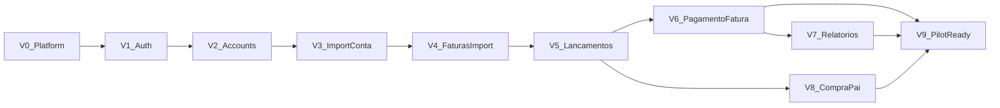

# Mão de Vaca — MVP Epic Roadmap (vertical slices)

**Status:** Rascunho para planejamento de implementação  
**Última atualização:** 2026-09-01  
**Fonte de verdade do produto:** [PROJECT_DEFINITION.MD](./PROJECT_DEFINITION.MD) (especialmente §3, §5 e §6)  
**Fonte de verdade da arquitetura:** [ARCHITECTURE.md](./ARCHITECTURE.md)

Épicos são **verticais**: cada um entrega um **resultado demonstrável** através de `src/server/` e `src/ui/`, adicionando apenas a persistência, endpoints e telas necessários para aquele recorte. Evitar concluir “todo o backend” ou “toda a UI” antes de qualquer fluxo funcionar ponta a ponta.

**Ordem de domínio (não negociável no MVP):** autenticação → **cadastro de contas/cartões** → importação → lançamentos/faturas → relatórios.

Após **V4**, o usuário consegue importar extrato de conta e fatura de cartão. **V5–V6** completam a leitura dos lançamentos nos dois regimes. **V7** fecha o dashboard. **V8** (compra-pai) pode ser desenvolvido em paralelo após V5. **V9** consolida deploy local e checklist de uso pessoal.

---

## Como épicos verticais diferem de camadas horizontais

| Horizontal (evitar) | Vertical (este plano) |
|---------------------|------------------------|
| “Criar todas as entidades Prisma” | Persistir **Conta + Cartão** quando V2 entrega cadastro |
| “Implementar todos os parsers” | Entregar **parser padrão** no modo que o épico exige (V3 ou V4) |
| “Construir todas as telas” | Entregar **telas do fluxo** que o épico demonstra |
| “Polir português no final” | **Copy PT** na tela que o épico introduz |

Preocupações transversais (logging, validação, testes TDD) são **tarefas dentro de cada épico**, não épicos separados.

---

## V0 — Platform slice: app sobe e responde

**Branch sugerida:** `feature/v0-platform`

**Resultado para o usuário:** `docker compose up` + `npm run dev` → API em `/api/health` OK; SPA carrega shell vazio com layout base.

**Entregas verticais:**

| Camada | Escopo |
|--------|--------|
| **`src/server/`** | NestJS scaffold; `GET /api/health`; prefixo global `/api`; serve SPA em prod (fallback `index.html`) |
| **`src/ui/`** | Vite + React scaffold; shell (`app.tsx`, `router.tsx`); página placeholder |
| **`prisma/`** | Cliente Prisma conectado ao PostgreSQL do Compose (sem domínio ainda) |
| **`docker-compose.yml`** | PostgreSQL + app (ou só DB no V0 se app rodar no host) |

**Demo:** `curl /api/health` → `{ "status": "ok" }`; browser em `/` mostra layout do app.

**Mapeia para:** ARCHITECTURE §4, §8; produto §7.1.

**Notas:** Sem auth nem domínio. TDD desde o primeiro endpoint. Spec detalhada de tarefas: `docs/epics/V0_PLATFORM.md` *(a criar)*.

| Fase | Resumo |
|------|--------|
| A Setup | Repo TS, Compose, scripts `dev` |
| B Server | NestJS, health, serve estático |
| C UI | Vite/React shell |
| D Sign-off | Demo manual + DoD |

---

## V1 — Auth slice: login e sessão

**Branch sugerida:** `feature/v1-auth`

**Resultado para o usuário:** Acessa `/login`, autentica com usuário fixo (env/seed), recebe sessão; rotas protegidas redirecionam sem sessão.

**Entregas verticais:**

| Camada | Escopo |
|--------|--------|
| **`src/server/modules/auth/`** | `POST /api/auth/login`, `POST /api/auth/logout`; JWT em cookie httpOnly; guard em rotas `/api/**`; seed do usuário único; `userId` no contexto |
| **`src/ui/modules/auth/`** | Página de login; hook de sessão; guard de rotas na SPA |
| **`prisma/`** | Entidade `User`; migration inicial |

**Demo:** Login → redirect para home; logout → volta ao login; `GET /api/accounts` sem cookie → 401.

**Mapeia para:** RF-00a–c; ARCHITECTURE §7 (Auth).

**Depende de:** V0.

---

## V2 — Accounts slice: cadastro de contas e cartões (setup inicial)

**Branch sugerida:** `feature/v2-accounts`

**Resultado para o usuário:** Após login, se não há contas/cartões, é orientado ao cadastro; cria **Conta** e **Cartão** com apelido e instituição; lista e desativa origens.

**Entregas verticais:**

| Camada | Escopo |
|--------|--------|
| **`src/server/modules/accounts/`** | CRUD `Account` + `Card`; `GET /api/setup/status`; desativação (`active: false`); filtro `userId` |
| **`src/ui/modules/accounts/`** | Telas `/contas` e `/cartoes` (ou aba única); formulários; redirect pós-login quando `setup/status` vazio; bloqueio de importação sem origem |
| **`prisma/`** | `Account`, `Card` com `userId` |

**Demo:** Primeiro login → wizard de cadastro → criar “Nubank CC” (conta) e “Visa Nubank” (cartão) → `setup/status.readyForImport` true → menu liberado.

**Mapeia para:** RF-00d–h; RN-08, RN-09; PROJECT_DEFINITION §3.4–3.5.

**Depende de:** V1.

**Milestone:** **Setup completo** — pré-requisito de qualquer importação.

| Fase | Resumo |
|------|--------|
| A Persistence | Prisma Account/Card |
| B API | CRUD + setup/status |
| C UI | Cadastro, listagem, onboarding guard |
| D Sign-off | Fluxo primeiro-login demo + testes de domínio |

---

## V3 — Import conta slice: extrato → lançamentos na conta

**Branch sugerida:** `feature/v3-import-conta`

**Resultado para o usuário:** Importa CSV no modo **transações**, seleciona **Conta** cadastrada e parser **Padrão**; vê resumo (novos, ignorados, erros) e histórico; lançamentos aparecem vinculados à conta.

**Entregas verticais:**

| Camada | Escopo |
|--------|--------|
| **`src/server/modules/import/`** | `POST /api/imports` (modo `transactions`); parser padrão → modelo canônico; deduplicação (RF-04); `ImportBatch`; persistência em `Transaction` com `accountId` |
| **`src/server/modules/transactions/`** | Persistência mínima (ainda sem UI de listagem completa) |
| **`src/ui/modules/import/`** | Formulário modo transações + conta + parser + upload; loading; resumo; histórico |
| **`prisma/`** | `Transaction`, `ImportBatch`; `dedupKey` |

**Demo:** Upload CSV de extrato → “12 criados, 0 ignorados” → consulta API confirma lançamentos com `accountId` e `competenceDate` = `cashDate` para débito.

**Mapeia para:** RF-01, RF-02a/b/d, RF-03–05, RF-06–07; RN-08.

**Depende de:** V2 (conta cadastrada).

**Notas:** Regime de caixa = competência para lançamentos de conta neste épico. Parser padrão pode ser CSV genérico documentado com exemplo em `docs/fixtures/`.

---

## V4 — Faturas + import cartão slice: fatura de cartão → compras no passivo

**Branch sugerida:** `feature/v4-faturas-import`

**Resultado para o usuário:** Cria **Fatura** para um cartão (mês referência, vencimento); importa CSV no modo **fatura** selecionando cartão + fatura + parser; compras/estornos entram na fatura; saldo e status derivados na listagem.

**Entregas verticais:**

| Camada | Escopo |
|--------|--------|
| **`src/server/modules/invoices/`** | `Invoice` (FK `cardId`); saldo/status derivados; `GET /api/cards/:id/invoices`, `POST` criar fatura |
| **`src/server/modules/import/`** | Modo `invoice` em `POST /api/imports` (`cardId` + `invoiceId`); lançamentos com `cardId`; estornos reduzem saldo |
| **`src/ui/modules/invoices/`** | Listar/criar faturas por cartão |
| **`src/ui/modules/import/`** | Formulário modo fatura (cartão + fatura + parser + upload) |

**Demo:** Criar fatura Jan/2026 do cartão → importar CSV da fatura → saldo derivado correto; status “em aberto”.

**Mapeia para:** RF-02c, RF-10–11, RF-14; RN-10; PROJECT_DEFINITION §3.7.

**Depende de:** V2 (cartão), V3 (import pipeline base).

**Milestone:** **Importação completa** (conta + cartão).

---

## V5 — Lançamentos slice: tabela filtrável e toggle de regime

**Branch sugerida:** `feature/v5-lancamentos`

**Resultado para o usuário:** Visualiza lançamentos em tabela com filtros (período, categoria, origem); alterna **competência ↔ caixa** globalmente; vê datas corretas por regime (cartão em caixa ainda incompleto se pagamento não vinculado — comportamento esperado).

**Entregas verticais:**

| Camada | Escopo |
|--------|--------|
| **`src/server/modules/transactions/`** | `GET /api/transactions?regime=&from=&to=&...`; cálculo de `cashDate` para cartão quando pagamento existir |
| **`src/ui/`** | Toggle global de regime (context/provider); tabela em `ui/modules/transactions/` |
| **`src/ui/modules/import/`** | Link “ver lançamentos” pós-importação |

**Demo:** Importar extrato + fatura → alternar regime → competência mostra compras de cartão no mês da compra; caixa mostra só débitos de conta até V6.

**Mapeia para:** RF-08, RF-09, RF-22; RN-06, RN-07.

**Depende de:** V3–V4 (dados para listar).

---

## V6 — Pagamento de fatura slice: vínculo manual e caixa de cartão

**Branch sugerida:** `feature/v6-pagamento-fatura`

**Resultado para o usuário:** Abre fatura com saldo em aberto; busca débitos na conta; vincula um ou mais pagamentos; saldo/status atualizam; compras de cartão passam a aparecer no regime de **caixa** na data do pagamento.

**Entregas verticais:**

| Camada | Escopo |
|--------|--------|
| **`src/server/modules/invoices/`** | `POST /api/invoices/:id/payments`; `InvoicePaymentLink` M:N; recálculo saldo/status; pagamento como `transferência` (RN-02) |
| **`src/server/modules/transactions/`** | Tipagem transferência para pagamento de fatura; `cashDate` propagado às compras da fatura vinculada |
| **`src/ui/modules/invoices/`** | Detalhe da fatura; UI de busca e vínculo manual de pagamentos |

**Demo:** Fatura com saldo R$ 500 → vincular débito de R$ 500 na conta → status “quitada”; toggle caixa mostra gastos de cartão no mês do pagamento, não no mês da compra.

**Mapeia para:** RF-12, RF-13; RN-02, RN-06, RN-07.

**Depende de:** V4–V5.

**Milestone:** **Regimes competência + caixa demonstráveis** para conta e cartão.

---

## V7 — Relatórios slice: dashboard do período

**Branch sugerida:** `feature/v7-relatorios`

**Resultado para o usuário:** Dashboard com indicadores (gasto, receita, saldo), quebra por categoria com % e evolução mensal; tudo respeita o toggle de regime global.

**Entregas verticais:**

| Camada | Escopo |
|--------|--------|
| **`src/server/modules/reports/`** | `GET /api/reports/summary`, `by-category`, `monthly-evolution`; excluir transferências e compra-pai das somas |
| **`src/ui/modules/reports/`** | Cards de indicadores; gráfico de categorias; gráfico de evolução mensal |

**Demo:** Período com extrato + fatura importados → alternar regime → totais e gráficos mudam de forma coerente com a tabela de lançamentos.

**Mapeia para:** RF-18–21; RN-01.

**Depende de:** V5 (toggle); V6 recomendado para demo completa em caixa.

---

## V8 — Compra-pai slice: agrupamento informacional de parcelas

**Branch sugerida:** `feature/v8-compra-pai`

**Resultado para o usuário:** Seleciona parcelas na tabela; vincula a compra-pai existente ou cria nova on-the-fly; compra-pai **não** entra em totais nem relatórios.

**Entregas verticais:**

| Camada | Escopo |
|--------|--------|
| **`src/server/modules/parent-purchases/`** | CRUD `ParentPurchase`; vínculo parcelas; exclusão das somas em reports |
| **`src/ui/modules/parent-purchases/`** | UI de agrupamento a partir da tabela de lançamentos |

**Demo:** Três parcelas do mesmo item → agrupar → relatórios inalterados (só parcelas contam).

**Mapeia para:** RF-15–17; RN-03.

**Depende de:** V5 (lançamentos listáveis). Pode rodar em paralelo com V6–V7 após V5.

---

## V9 — Pilot-ready slice: uso pessoal confiável

**Branch sugerida:** `feature/v9-pilot-ready`

**Resultado para o usuário:** App roda de forma estável no ambiente pessoal (Compose prod ou script único); CSV de exemplo documentado; checklist de fluxo completo executado.

**Entregas verticais:**

| Camada | Escopo |
|--------|--------|
| **Ops** | `docker compose` prod; variáveis documentadas; seed de usuário |
| **`docs/`** | `docs/fixtures/` com CSVs exemplo; checklist de piloto em 1 página |
| **QA** | Reimportação (dedup); pagamento parcial; cross-bank (conta A paga cartão B) |

**Demo:** Fluxo completo em máquina limpa: login → cadastro → import extrato → import fatura → vincular pagamento → dashboard competência e caixa.

**Mapeia para:** metas não-funcionais ARCHITECTURE §10; produto §4.1 integral.

**Depende de:** V6–V7 mínimo; V8 opcional.

**Milestone:** **MVP pessoal utilizável**.

---

## Marcos (o que mostrar)

| Marco | Épicos | Demo |
|-------|--------|------|
| **Boot** | V0 | Health + shell SPA |
| **Acesso** | V1 | Login/logout |
| **Setup** | V2 | Cadastrar conta e cartão; onboarding |
| **Extrato** | V3 | Importar CSV na conta |
| **Cartão** | V4 | Fatura + import CSV de fatura |
| **Visão** | V5 | Tabela + toggle de regime |
| **Caixa cartão** | V6 | Vincular pagamento; regimes completos |
| **Dashboard** | V7 | Indicadores e gráficos |
| **Parcelas** | V8 | Compra-pai informacional |
| **MVP pessoal** | V9 | Checklist ponta a ponta |

---

## Padrão de tarefas dentro de cada épico vertical

1. **Definir limite do slice** — quais rotas `/api/**` e telas mudam.
2. **`src/server/`** — controller + service + apenas tabelas/colunas Prisma deste slice.
3. **`src/ui/`** — telas + client HTTP; tipos locais (sem `shared/`).
4. **Roteiro de demo** — um parágrafo: usuário faz X, espera Y.
5. **Adiar** — o que não é necessário para demonstrar este slice.

**Regras:** sem imports `server/` ↔ `ui/`; TDD obrigatório ([quality-gate.mdc](../.cursor/rules/quality-gate.mdc)); copy em português.

---

## Backlog MVP+ (não são épicos verticais)

- Parsers adicionais por banco/formato
- Detecção automática de parser
- Orçamentos e metas
- Comparação competência × caixa lado a lado
- Multi-moeda
- Multitenant ativo (cadastro de usuários)
- Fila assíncrona para importações grandes

---

## Decisões técnicas em aberto (resolver no épico que precisar)

| Decisão | Resolver em |
|---------|-------------|
| Plugin Vite no NestJS vs proxy em dev | V0 |
| Estratégia de `dedupKey` | V3 |
| Formato do parser padrão (colunas CSV) | V3 |
| Biblioteca de gráficos | V7 |
| `dedupKey` inclui `accountId`/`cardId`? | V3 |

---

## Documentos relacionados

| Documento | Propósito |
|-----------|-----------|
| [PROJECT_DEFINITION.MD](./PROJECT_DEFINITION.MD) | Escopo, conceitos e requisitos funcionais |
| [ARCHITECTURE.md](./ARCHITECTURE.md) | Arquitetura técnica e API |
| [.cursor/rules/architecture.mdc](../.cursor/rules/architecture.mdc) | Regras Cursor — fronteiras |
| [.cursor/rules/quality-gate.mdc](../.cursor/rules/quality-gate.mdc) | TDD e Definition of Done |
| `docs/epics/V0_PLATFORM.md` | *(a criar)* Spec detalhada V0 |

---

## Histórico do documento

| Data | Alteração |
|------|-----------|
| 2026-09-01 | Versão inicial: épicos verticais V0–V9 alinhados a cadastro-first e regimes competência/caixa |
